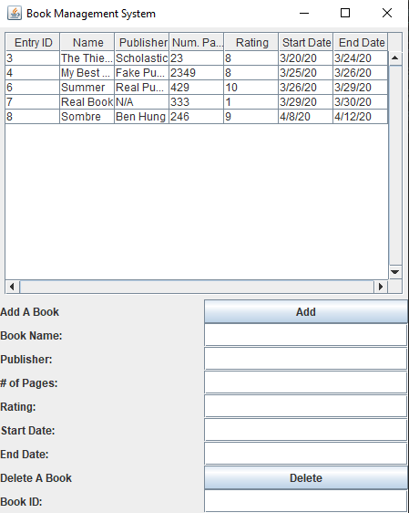

# Book Management System

A program to store books (such as the books a user has read), and view various statistics about the books stored. Written in Java, with database management using PostgreSQL and GUI implementation using Swing.

How to use:

Adding a book:
Input your desire values in the text fields, and press the "Add" button. Make sure the rating and num_pages fields consist of integers, otherwise it will not update.

Deleting a book:
Find the book name in the table, input the name in the corresponding text field (under "Delete a Book"), and press the delete button. If there are multiple books with the same name, it will delete all of them (to be fixed).

In-Progress:
- automatically updating table using TableListeners in Java Swing

To-do:
- graphs????
- statistics in GUI
- unique book IDs so you can delete by id.

Bugs:
- deleting a book with the same name as another book wll delete all books
- need some way of error checking

Done:
- add read-date to Book class
- storing book information in PostgreSQL
- basic GUI using Java Swing

